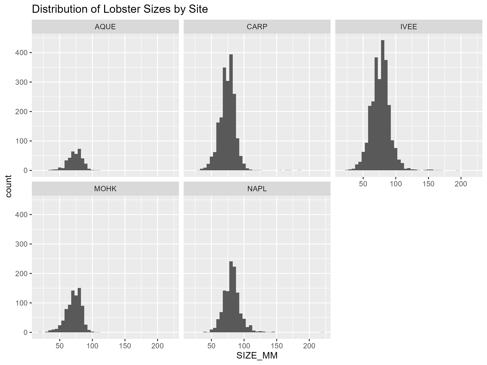
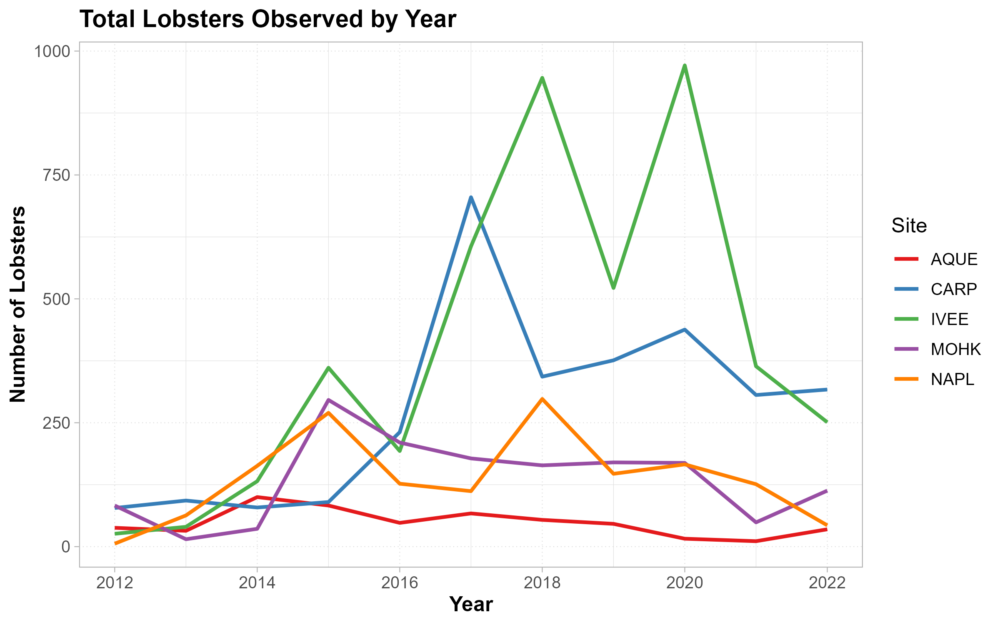
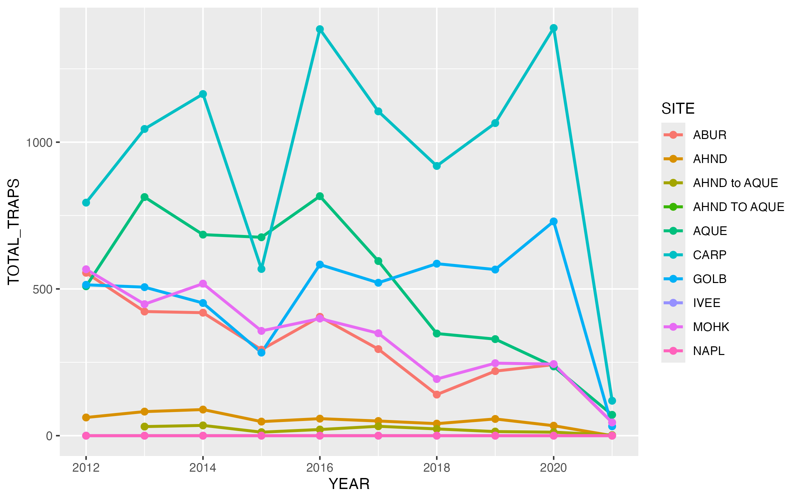
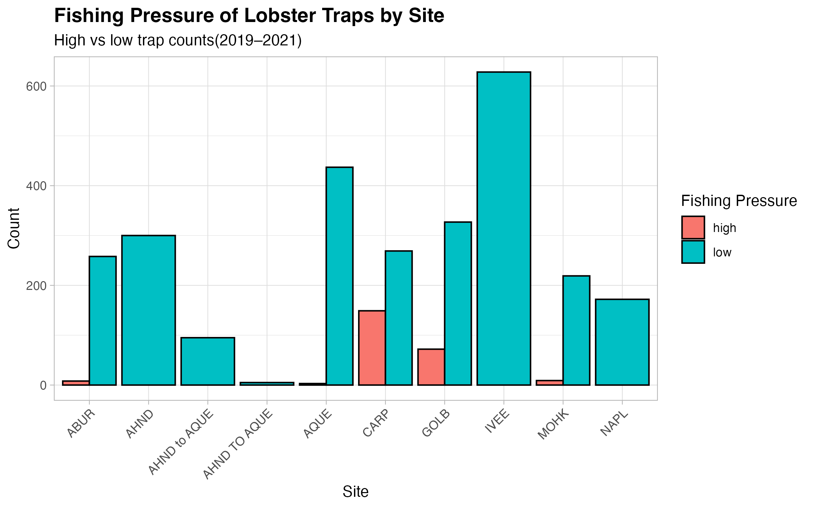

## Introduction

In this report, we aim to better understand how lobster populations and fishing activity change over time, which is essential for managing marine ecosystems. Here we specifically analyze patterns in lobster abundance, size, and fishing pressure across multiple reef sites in the Santa Barbara Channel.

## Data Source

The data in this report come from the Environmental Data Initiative data package:

-   Santa Barbara Coastal LTER, D. Reed, and R. Miller. 2022. SBC LTER: Reef: Abundance, size and fishing effort for California Spiny Lobster (Panulirus interruptus), ongoing since 2012 ver 8. Environmental Data Initiative. <https://doi.org/10.6073/pasta/25aa371650a671bafad64dd25a39ee18.> Accessed April 16, 2026.

This data package contains two tables, one focused on lobster abundance and size, and one focused on lobster trap buoy counts. `Lobster_Trap_Counts_All_Years_20210519.csv`and `Lobster_Abundance_All_Years_20220829.csv`

## Abstract Summary

This dataset examines California spiny lobster ,*Panulirus interruptus*, abundance, size, and fishing pressure along the mainland coast of the Santa Barbara Channel. Lobsters are important predators in giant kelp forests, this data sets helps researchers study how fishing and marine protected areas may influence kelp forest communities.

## Owner Analysis and Visualization

### Lobster Size Distribution by Site

{fig-alt="Histogram showing lobster size distribution across sites"}

This histogram shows how lobster sizes vary across different sites. Some locations show a wider range of sizes, while others are more concentrated, suggesting differences in population structure.

### Lobster Abundance Over Time

{fig-alt="Line graph showing lobster counts by year and site"}

This plot shows how lobster abundance changes over time at each site. Some sites exhibit increasing or fluctuating trends, while others remain relatively stable, indicating possible environmental or protection-related influences.

## Collaborator Analysis and Visualization

Data :Lobster_Trap_Counts_All_Years_20210519.csv\
In this part of our analysis we worked on the lobster trap counts data. Focusing on two questions, how total trap counts changed over time at each site, and how more recent observations from 2019 to 2021 can be categorized into high and low fishing pressure.

This plot shows how total trap buoy counts changed over time at each site. Some sites show higher overall trap counts others remain comparatively low. Here we can see the differences in fishing activity across locations.

This plot compares the number of high and low fishing pressure observations across sites for the years 2019 to 2021. ( \< 8 = low/ \>= 8 = high ) Some sites have more frequent high trap counts, which indictates greater fishing pressure during that time.

## Discussion

From these analyses, several patterns emerge:

-   Lobster size distributions vary across sites, suggesting differences in population structure or environmental conditions
-   Lobster abundance trends differ by site, with some showing increases or variability over time
-   Fishing pressure is not uniform, with certain sites experiencing consistently higher trap counts

Together, these findings suggest that both environmental factors and human activity, such as fishing, may influence lobster populations. Additionally, marine protected areas may play a role in shaping these patterns, though further analysis would be needed to confirm this.
